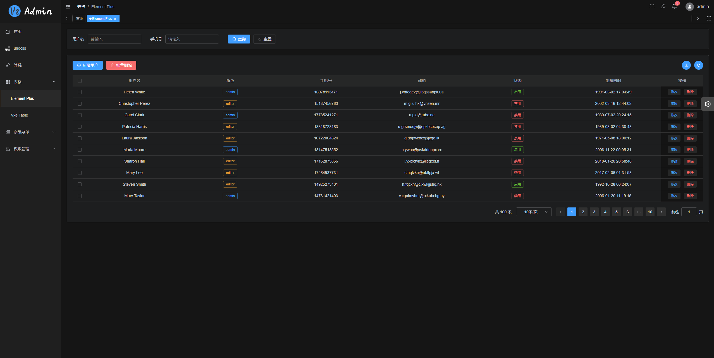
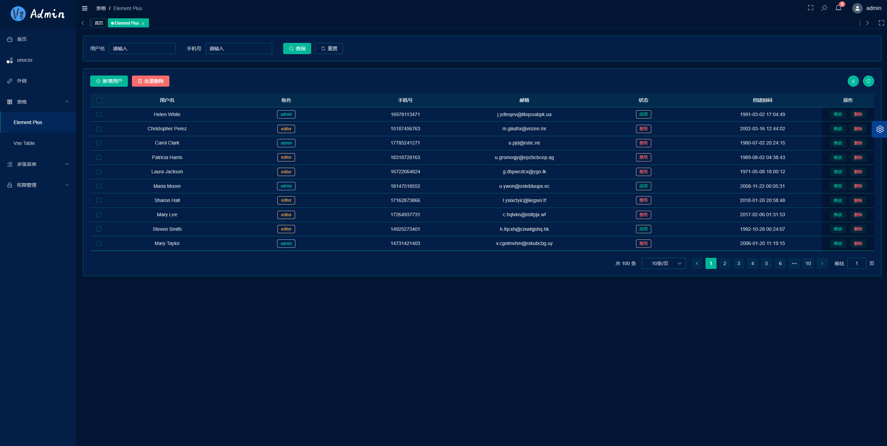

## Development

```bash
# configure
1. installation of the recommended plugins in the .vscode directory
2. node version 18.x or 20+
3. pnpm version 8.x or latest

# install dependencies
pnpm i

# start the service
pnpm dev
```

## Preview

```bash
# stage environment
pnpm preview:stage

# prod environment
pnpm preview:prod
```

## Multi-environment packaging

```bash
# build the stage environment
pnpm build:stage

# build the prod environment
pnpm build:prod
```

## Code inspection

```bash
# code formatting
pnpm lint

# unit test
pnpm test
```

## Git commit specification reference

- `feat` add new functions
- `fix` Fix issues/bugs
- `perf` Optimize performance
- `style` Change the code style without affecting the running result
- `refactor` Re-factor code
- `revert` Undo changes
- `test` Test related, does not involve changes to business code
- `docs` Documentation and Annotation
- `chore` Updating dependencies/modifying scaffolding configuration, etc.
- `workflow` Work flow Improvements
- `ci` CICD
- `types` Type definition
- `wip` In development

## Project preview






## License

[MIT](./LICENSE)